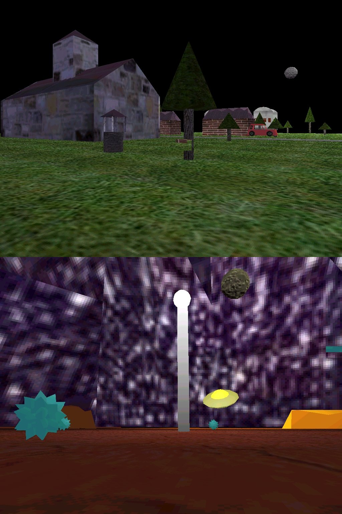



## engineX beta demo 1 by Simon Price

### Description

UPDATED AGAIN: 3 more major bugs fixed!

UPDATED: many bugs fixed already !

*** engineX beta demo 1 ***

engineX was designed to be as simple and reusable as possible. It uses DirectX 8. It features:

- 3D graphics with support for hardware acceleration

- dot, line and triangle primitives

- materials

- texture mapping with transparency

- lighting

- frame hierarchies

- loads .x files

- loads .exf files (a custom file format, made specifically for engineX, has it's own editor, not released yet)

- collision detection

- 2D and 3D sound (mono wave file only)

- input from keyboard and mouse

- MIDI music

This demo was designed to demonstrate most of these features, as quickly and simply as I could. There are 2 sample worlds to choose from (see screenshots). In the demo you can just walk and look around, and bump into objects in your way.

I need as much feedback and bug reports as possible, it's very hard to get DirectX to work on all OS's and hardware, I especially have problems with Windows 2000. PLEASE DO VOTE if you find the code to be useful/well written/cool in some way

The demo is 1.9MB, so I couldn't upload it to PSC, please instead use this direct link to the zip file stored on my website.

http://www.VBgames.co.uk/downloads/exdemob1.zip

If you just need the source code because you've already got the resources, use :

http://www.VBgames.co.uk/downloads/exdemob1src.zip
 
### More Info
 

             |
---                |---
**Submitted On**   |
**By**             |[Simon Price](https://github.com/Planet-Source-Code/PSCIndex/blob/master/ByAuthor/simon-price.md)
**Level**          |Advanced
**User Rating**    |4.7 (94 globes from 20 users)
**Compatibility**  |VB 6\.0
**Category**       |[DirectX](https://github.com/Planet-Source-Code/PSCIndex/blob/master/ByCategory/directx__1-44.md)
**World**          |[Visual Basic](https://github.com/Planet-Source-Code/PSCIndex/blob/master/ByWorld/visual-basic.md)
**Archive File**   |

### Source Code

Sorry, couldn't upload, please use http://www.VBgames.co.uk/downloads/exdemob1.zip

